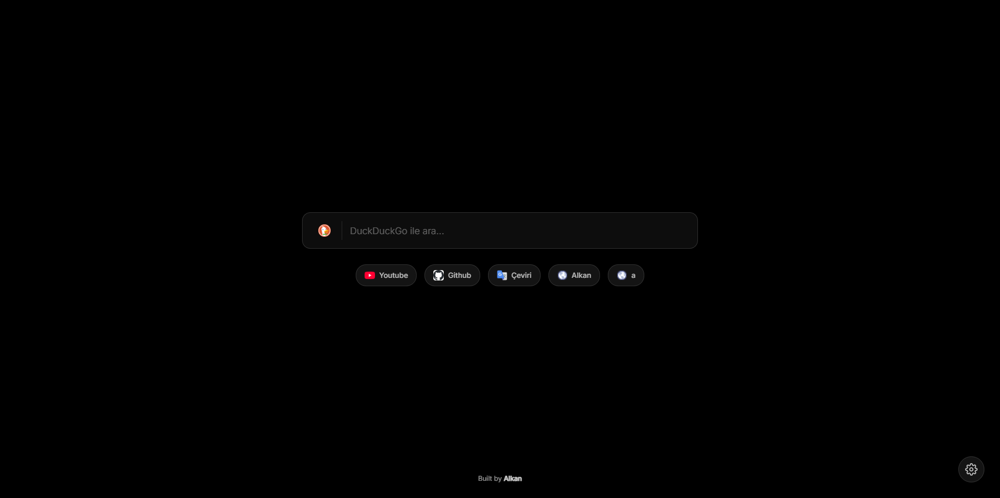
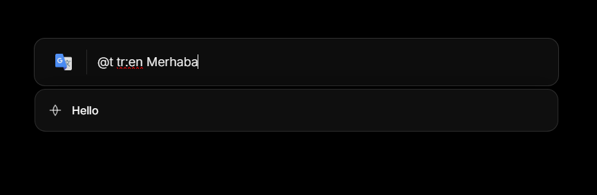

# Alkan Tab

**Alkan Tab**, tarayıcı deneyiminizi tamamen özelleştirmenize olanak tanıyan, modern, hızlı ve minimalist bir "Yeni Sekme" (New Tab) eklentisidir.

## Özellikler

*   **Çoklu Arama Motoru Desteği:** Google, DuckDuckGo veya Bing arasında kolayca geçiş yapın.
*   **Akıllı Arama Önerileri:** Arama geçmişiniz ve API destekli önerilerle daha hızlı sonuçlara ulaşın.
*   **Özelleştirilebilir Kısayollar:** Sık kullandığınız web sitelerini (Gmail, YouTube, GitHub vb.) ana ekranınıza ekleyin ve sırayla düzenleyin.
*   **Dahili Eklentiler (Plugins):**
    *   `@y` veya `@youtube`: YouTube'da hızlı arama yapın.
    *   `@t` veya `@translate`: Hızlıca çeviri yapın (Örn: `@t en:tr hello`).

    

*   **Özel Eklenti Oluşturma:** Kendi kısayollarınızı ve tetikleyicilerinizi oluşturun (Örn: `@gh` -> GitHub'da ara).
*   **Tema Seçenekleri:** Koyu (Dark), Açık (Light) veya Sistem teması seçenekleri.
*   **Görünüm Modları:** Kısayolları "Sadece İkon", "Sadece Yazı" veya "Her İkisi" şeklinde görüntüleyin.

## Kurulum (Geliştirici Modu)

Bu eklentiyi henüz Chrome Web Mağazası'nda yayınlanmadığı için "Geliştirici Modu" ile yükleyebilirsiniz:

1.  Bu projeyi bilgisayarınıza indirin (ZIP olarak indirip çıkartın veya `git clone` yapın).
2.  Chrome tarayıcısında adres çubuğuna `chrome://extensions` yazın ve Enter'a basın.
3.  Sağ üst köşedeki **Geliştirici modu (Developer mode)** anahtarını açın.
4.  Sol üstte beliren **Paketlenmemiş öğe yükle (Load unpacked)** butonuna tıklayın.
5.  İndirdiğiniz proje klasörünü seçin.

Artık yeni bir sekme açtığınızda **Alkan Tab** sizi karşılayacak!
